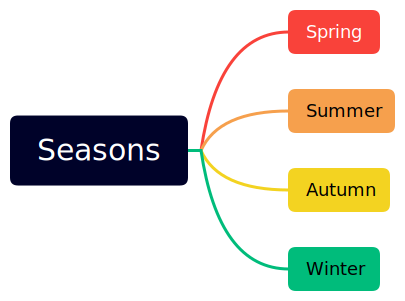

# M3 - Lightweight markup language for **mind mapping**

[M3](docs/m3.md) is a lightweight markup language for **mind mapping** inspired by **markdown**. It is designed to describe structures and elements of a mind map easily.

Just like everyone can use mind mapping software to organize ideas and improve efficiency, **everyone can benefit from M3**.

M3 files are written in plain text, which means that you can describe a mind map faster using any text editor at any time anywhere, like:

```
Seasons
- Spring
- Summer
- Autumn
- Winter
```

For more infomation about **M3 syntax**, please visit [M3 language specification](docs/m3.md).

The recommended way to save an M3 file is to use `.m3` as its extension name, though you can use any other names as you like. If you are developing an application that distributes or generates M3 files, you're encouraged to use `application/vnd.xmind.m3` as the [mime type](https://en.wikipedia.org/wiki/Media_type), or `org.xmind.openformat.m3` as the [UTI](https://developer.apple.com/documentation/uniformtypeidentifiers).

## From M3 to Mind Map

[xmind-m3](https://github.com/xmindltd/m3) is a toolset that helps you convert M3 files into various forms of mind maps easily.

For an M3 file with the following content,
```
Seasons
- Spring
- Summer
- Autumn
- Winter
```
you can easily convert it to a graphical mind map using [xmind-m3](https://github.com/xmindltd/m3):



See also:
- [Use xmind-m3 as a CLI program](#use-xmind-m3-as-a-cli-program)
- [Use xmind-m3 as a Javascript library](#use-xmind-m3-as-a-javascript-library)
- [Roadmap](#roadmap)
- [Troubleshooting](#troubleshooting)

### Use xmind-m3 as a CLI program

#### Install
Make sure [Node.js](https://nodejs.org) and [npm](https://www.npmjs.com/) is available on your computer, and run the command below in your command line program:

```
npm install -g xmind-m3
```

#### Convert M3 file to XMind file

```bash
> m3 <your-m3-file>
```

A `.xmind` file will be generated in your working directory, which can then be opened and further edited using [XMind](https://www.xmind.net).

You can also pass your M3 file through standard input:

```bash
> cat <your-m3-file> | m3
```

This command has the same effect as the previous one.

#### Convert M3 file to SVG file

```bash
> m3 -f svg <your-m3-file>
# or
> m3 --format svg <your-m3-file> 
```

You can use `-f` or `--format` flag to specify the target format of the output file. So far xmind-m3 supports these target formats:
- `xmind`
- `svg`

If no target format is specified, xmind-m3 will use `xmind` by default.

In the case above, a `.svg` file will be generated in your working directory.

#### Specify the output directory

```bash
> m3 -o ./out <your-m3-file>
# or
> m3 --outputDir ./out <your-m3-file>
```

You can use `-o` or `--outputDir` flag to specify the output directory where the generated file will be placed. Both relative and absolute path are supported.

#### Get more information
```bash
> m3 -h
# or
> m3 --help
```

### Use xmind-m3 as a Javascript library

#### Install
```bash
> npm install xmind-m3 -S
```

#### Usage

```typescript
import { parseM3ToXMindFile } from 'xmind-m3'

const m3FileContent = `
Central Topic
- Main Topic 1
- Main Topic 2
`

const xmindArrayBuffer = await parseM3ToXMindFile(m3FileContent)

```

Currently, xmind-m3 only supports converting `string` content to [`ArrayBuffer`](https://developer.mozilla.org/en-US/docs/Web/JavaScript/Reference/Global_Objects/ArrayBuffer) of `.xmind` file. You can then save it to the local disk or upload it to an online storage.

### Roadmap

- **Default theme**. Generate files with pretty color theme. 
- **Syntax parser API**. Improve and expose the parser API to allow developers to obtain more detailed syntax and semantic information.
- **Editor language support**. Allow users to interact with M3 files easily and gracefully in text editors like Visual Studio Code.

### Troubleshooting

#### Getting stuck during conversion process

Converting M3 files to `.svg` files relies on a graphical environment, so when xmind-m3 converts an M3 file to a `.svg` file for the every first time, it must complete the following preparations:

1. Download a *bundled version* (specified [here](https://github.com/puppeteer/puppeteer/#q-which-chromium-version-does-puppeteer-use)) of Chromium by [puppeteer-core](https://www.npmjs.com/package/puppeteer-core).
2. Download the mind map rendering engine from XMind official website: https://assets.xmind.net.

These downloads will be cached in the local disk. The next time, xmind-m3 will just start converting if the cache is still valid.

If there is a problem during the preparation, please check whether your network is available. If the problem still exists, please [create an issue](https://github.com/xmindltd/m3/issues/new).

#### "Output file exists"

If the file to be exported already exists, xmind-m3 will report a warning message and quit without doing anything else.

#### Other issues not mentioned here

You can try to find existing related [issues](https://github.com/xmindltd/m3/issues), otherwise please [create an issue](https://github.com/xmindltd/m3/issues/new) and report to us.
